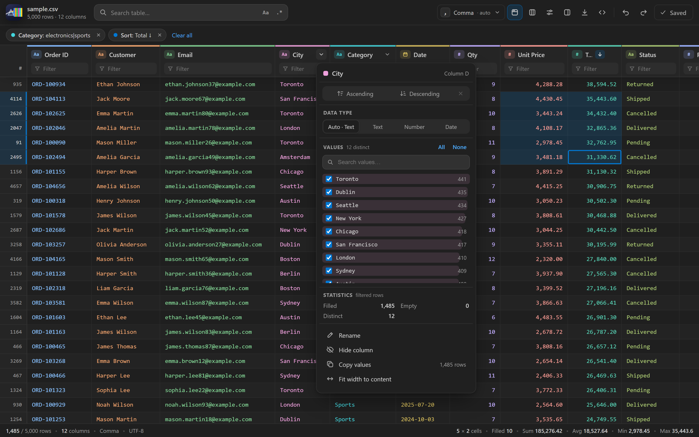

# Prism CSV

[](https://github.com/emrekesler/prism-csv/actions/workflows/ci.yml)
[](LICENSE)

Open CSV/TSV files in VS Code as a fast, colorful table, and edit them in place. No dependencies, smooth with hundreds of thousands of rows.

The interface is in English by default and switches to Turkish when VS Code's display language is Turkish. · [Türkçe](README.tr.md)



## Features

- **In-cell editing:** Double-click, press `Enter` or `F2`, or just start typing. `Enter` commits and moves down, `Tab` moves right, `Shift/Alt+Enter` inserts a line break, `Esc` cancels.
- **Formatting is preserved:** Only the edited field changes in the file. Quotes, line endings and other cells stay exactly as they were.
- **Bulk actions:** `Delete` clears the selected cells. `Ctrl+V` pastes a block copied from Excel starting at the selected cell; a single value fills the whole selection.
- **Move columns:** Drag a header to a new position; every row in the file is reordered.
- **Rename columns:** Use **Rename** in the column menu to change the header row.
- **Right-click menus:** On cells, row numbers and headers: cut/copy/paste, insert or delete rows and columns (also several at once), filter by a value, row details. Deletions can be undone with `Ctrl+Z`.
- **Save:** The **Save** button lights up when there are changes (`Ctrl+S` works too). Undo/redo buttons and `Ctrl+Z`/`Ctrl+Y` use VS Code's own history. Unsaved cells are marked with an amber bar.
- **Colored columns:** Each column gets its own color, tuned for light and dark themes. Choose *Text*, *Background* or *Off* in the View menu.
- **Sorting:** Click a header to sort ascending, again for descending, a third time to clear. **Shift+click** sorts by multiple columns. Numbers, dates and text sort correctly for your locale.
- **Column filters:** Type an expression in the box under each header (see the table below).
- **Value lists:** The column menu (⌄) has Excel-style checkable values with counts and an "only" button.
- **Global search:** `Ctrl+F`, with match-case and regex options; matches are highlighted.
- **Statistics:** The column menu shows filled, empty and distinct counts, plus sum, min, max, average and a histogram for numbers and the range for dates.
- **Selection:** Click, Shift+click or drag to select. The status bar shows sum, average, min and max. `Ctrl+C` copies as TSV, ready to paste into Excel.
- **Row details:** Press `Space` or double-click a row number to see every field of a row; JSON values are pretty-printed.
- **Auto-detection:** Delimiter (`,` `;` tab `|`), number format (`1,234.56` or `1.234,56`) and date format (ISO, `dd.mm.yyyy`). Column types can be overridden from the menu.
- **Export:** Save the filtered view to a file, or copy it as CSV, TSV, Markdown or JSON.
- **Live updates:** The table follows changes made in the text editor.
- **Encodings:** For files that are not UTF-8, a likely encoding is suggested based on your language; others can be picked from a menu.

## Filter syntax

| Type | Meaning |
|---|---|
| `london` | contains |
| `=London` / `!=London` | equals / not equal |
| `!cancelled` | does not contain |
| `>100`, `>=100`, `<5`, `<=5` | compare (number, date or text) |
| `10..50`, `2024-01-01..2024-03-31` | range |
| `^SP-1` / `com$` | starts with / ends with |
| `/^\d{3}$/i` | regular expression |
| `=` / `!=` | empty / not empty |
| `a \| b`, `>10 & <20` | or / and |

## Keyboard

| Key | Action |
|---|---|
| `Ctrl+F` | search |
| Arrows, `PageUp/Down`, `Home/End` | navigate (`Ctrl` jumps to the edge) |
| `Shift` + arrows | extend selection |
| `Ctrl+A` / `Ctrl+C` / `Ctrl+V` | select all / copy / paste |
| `Enter`, `F2`, double-click, typing | edit cell |
| `Delete` / `Backspace` | clear selected cells |
| `Ctrl+S` / `Ctrl+Z` / `Ctrl+Y` | save / undo / redo |
| `Space` | toggle row details |
| `Esc` | cancel edit, close menu, panel or selection |

## Installation

Build the VSIX (or download it from the artifacts of the latest [CI run](https://github.com/emrekesler/prism-csv/actions/workflows/ci.yml)) and install it:

```bash
npm run package
code --install-extension prism-csv-1.1.0.vsix
```

CSV files then open in the table automatically. Use **Open as text** in the toolbar (or *Reopen Editor With…*) to switch back to the text editor.

## Development

No dependencies to install; Node.js 20+ is enough.

- **Sample data:** `npm run sample` generates `dev/sample.csv` (5,000 rows, not committed). `npm run sample -- --tr` generates a Turkish-formatted `dev/sample-tr.csv` (`;`, `1.234,56`, `dd.mm.yyyy`). `node dev/make-sample.js 300000 dev/big.csv` generates a large file.
- **Debug:** Open the folder in VS Code and press `F5`; the Extension Development Host opens `dev/`.
- **Browser preview:** Run `npm run preview` and open http://localhost:5178 (shows `dev/sample.csv`). Add `?lang=tr` for Turkish, `?light` for the light theme, `?file=/dev/big.csv` for another file.
- **Tests:** `npm test` (parsing, cell edits, column moves) and `npm run check-l10n` (translations). CI runs both on every push and pull request.
- **Screenshot:** With the preview running, `npm run screenshot` regenerates `docs/screenshot.png` using headless Chrome or Edge.

Strings are written in English in the code. Translations live in `l10n/bundle.l10n.<lang>.json` (UI and extension messages) and `package.nls.<lang>.json` (commands and settings); adding a language means adding those two files.

The parser and edit logic live in `media/csv-core.js` and are shared by the webview and the extension. Editing is disabled on read-only file systems (e.g. git diffs) and when a custom encoding is used.

## Contributing

Issues and pull requests are welcome. Please run `npm test` and `npm run check-l10n` before opening a pull request.

## License

[MIT](LICENSE) © Emre Kesler
